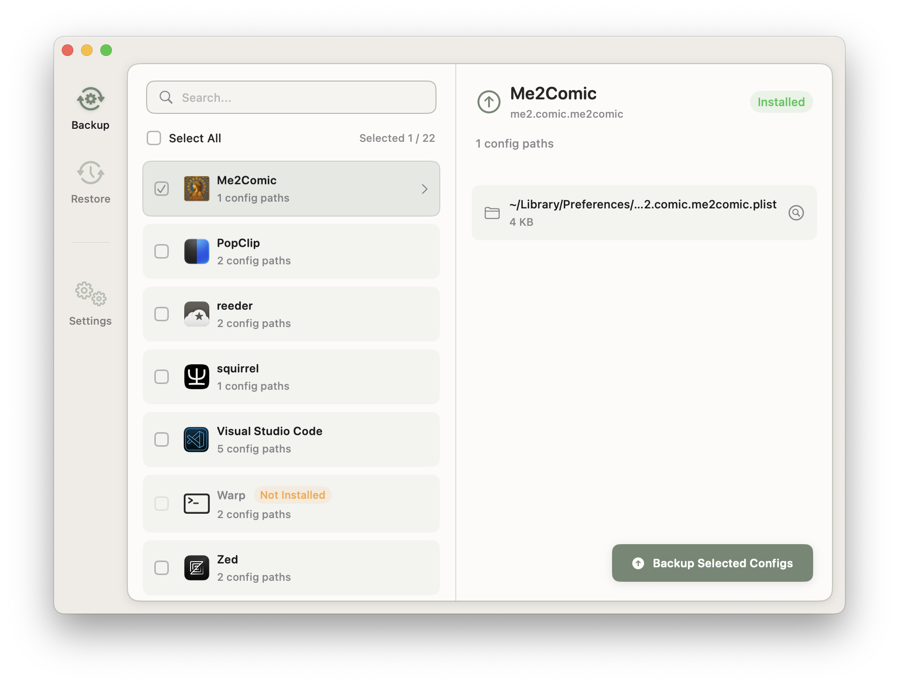
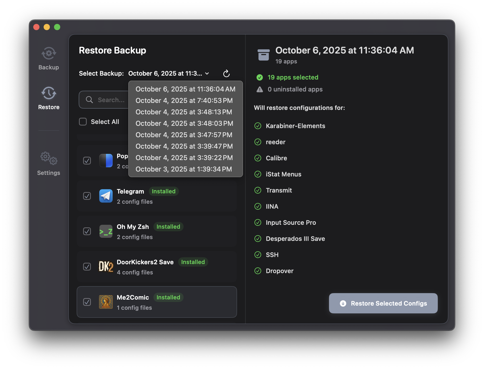
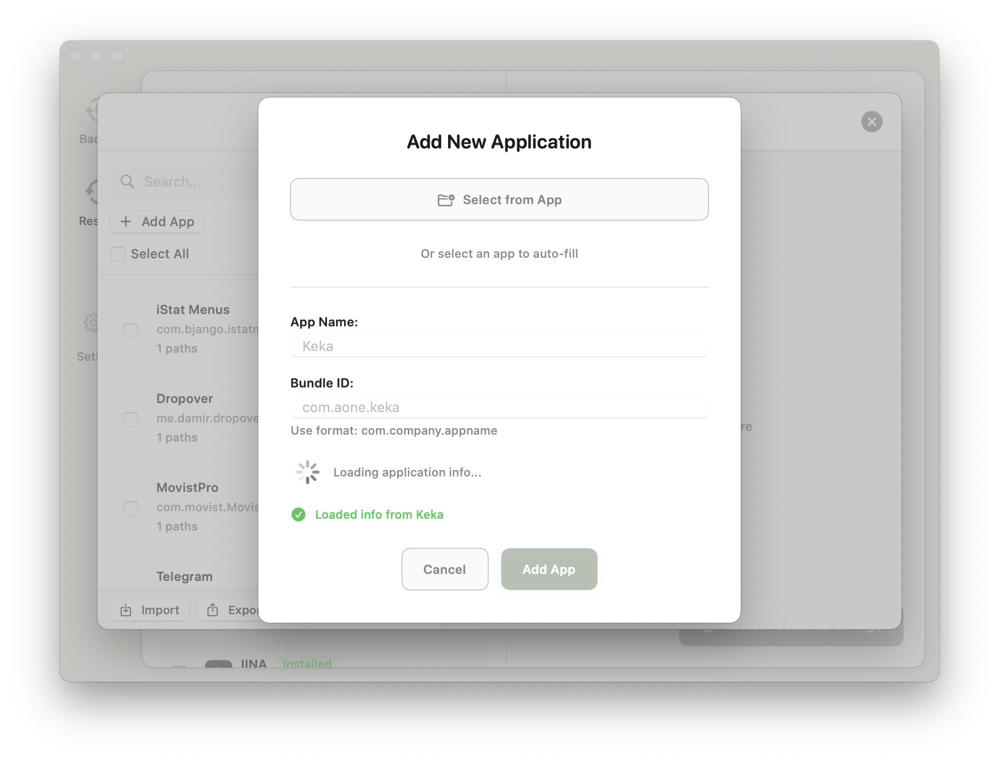
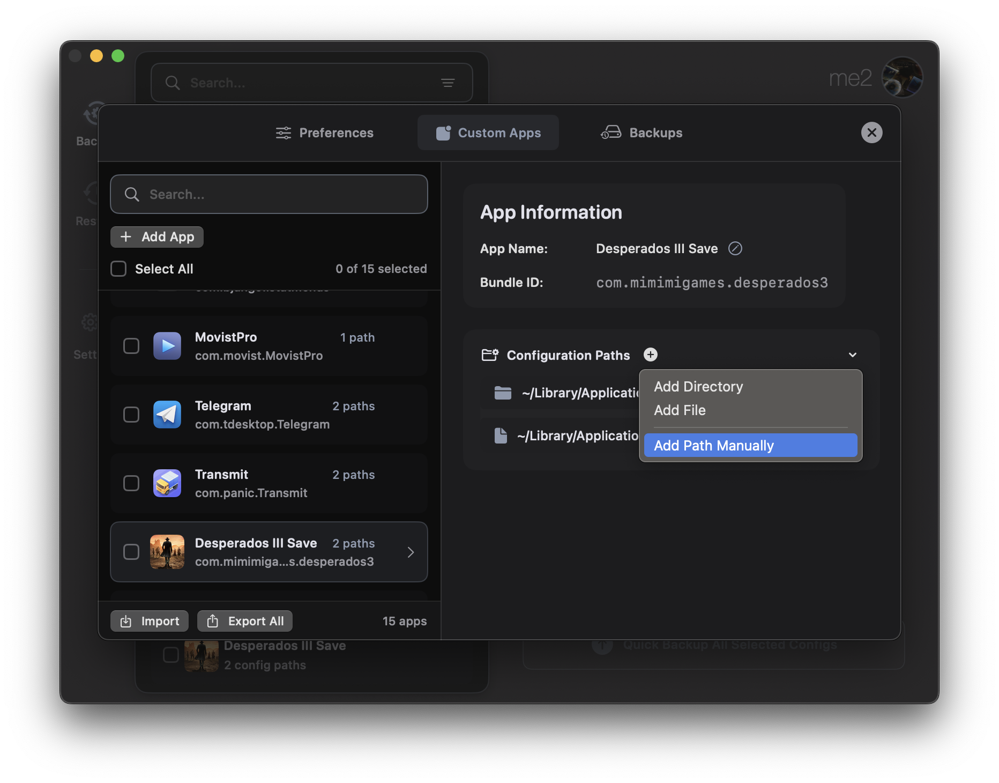

# PocketPrefs

[English](README.md) | [中文](docs/README_zh.md)

PocketPrefs is a configuration management tool for macOS applications. It enables users to easily back up, restore, and manage application configurations and data, simplifying setup when migrating to a new device or reinstalling macOS.

  
  

  
  

💡 Besides app settings, you can back up any file via custom paths.

## Features

- Backup and restore macOS application configurations and specified data
- Add and manage custom application configuration paths
- Import and export custom application configuration lists
- Incremental backup mode support

## 📦 Configuration Sharing

Here's my custom configs JSON (importable): <a href="https://github.com/DawnLiExp/PocketPrefs/discussions/1" target="_blank">discussion</a>

## Data Security ⚠️

PocketPrefs uses the following strategy to protect existing configurations when restoring files:

### Design Principles

- **Data integrity:** Before restoring configuration files, PocketPrefs first renames any existing configuration in the target directory to `[original_name].pocketprefs_backup` to preserve the original state.

### Operation Details

When performing a restore operation, PocketPrefs intelligently handles existing files or directories at the target path:

1. **Existing configuration backup:** If a file or directory with the same name already exists at the target path (for example, `~/Library/Application Support/Code/User/settings.json` or `~/Library/Application Support/Code/User/`), PocketPrefs renames it to `[original_name].pocketprefs_backup`.  
   - **Example:** `settings.json` becomes `settings.json.pocketprefs_backup`.  
   - **Example:** `User/` directory becomes `User.pocketprefs_backup/`.

2. **New configuration restoration:** The file or directory from the backup is then restored to the original target path.

**Important Note:**

- `.pocketprefs_backup` files or directories only preserve the configuration state from the **most recent restore operation**. Each new restore operation will overwrite this backup.

## System Requirements

- macOS 14+

## Building

- Xcode 16+
- Swift 6
