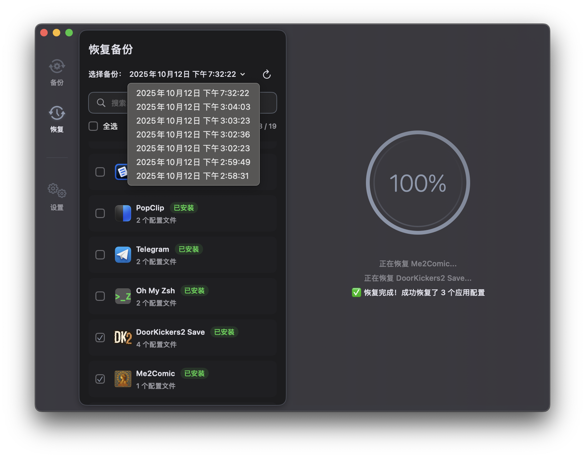
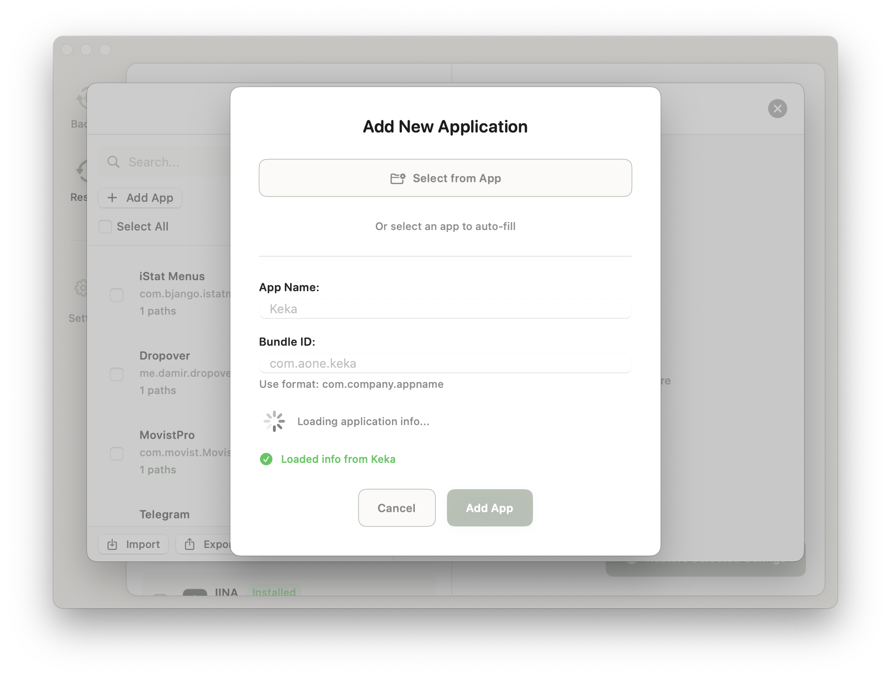

# PocketPrefs

[English](README.md) | [中文](docs/README_zh.md)

PocketPrefs 是一款 macOS 下的应用程序配置管理工具。它允许用户轻松备份、恢复和管理应用程序的配置文件及数据，简化在新设备或重装系统后的配置过程。

  
  
  

## 功能特性

- 备份和恢复 macOS 应用程序的配置与指定数据
- 添加并管理自定义应用程序的配置路径
- 导入 / 导出自定义的应用程序配置列表
- 备份默认存放路径：`~/Documents/PocketPrefsBackups`

## 数据安全 ⚠️

PocketPrefs 在恢复关键配置文件时，采用以下策略以保障现有配置的完整性：

### 设计原则

- **数据完整性：** 恢复配置文件前，会先将目标目录中已有的原始配置重命名为 `[原始名称].pocketprefs_backup`，以保留原始状态。

### 操作详情

当执行恢复操作时，PocketPrefs 会智能处理目标路径下的同名文件或目录：

1. **现有配置备份：** 如果目标路径（例如 `~/Library/Application Support/Code/User/settings.json` 或 `~/Library/Application Support/Code/User/` 目录）已存在同名文件或目录，PocketPrefs 会先将其重命名为 `[原始名称].pocketprefs_backup`。
   - **示例：** `settings.json` 会变为 `settings.json.pocketprefs_backup`。
   - **示例：** `User/` 目录会变为 `User.pocketprefs_backup/`。

2. **新配置恢复：** 然后，备份中的文件或目录将被恢复到原始目标路径。

**重要提示：**

- `.pocketprefs_backup` 文件或目录仅保留最近一次恢复操作之前的配置状态；每次新的恢复操作都会刷新该备份。

## 系统要求

- macOS 14+

## 构建

- Xcode 16+
- Swift 6
